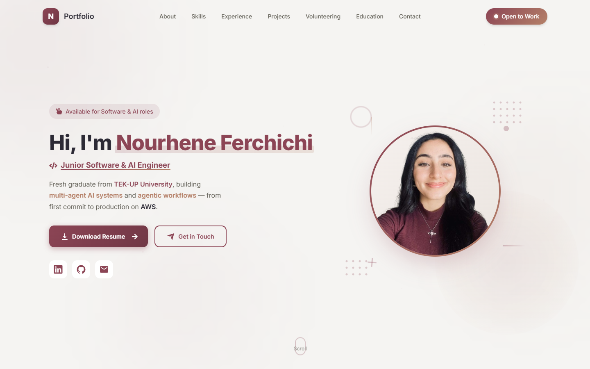

# Nourhene Ferchichi — Portfolio

The site I use to present my work as a Software & AI Engineer. I maintain it like a production codebase: typed content, CI on every push, performance and accessibility treated as requirements.

**🔗 [portfolio-nourheneferchichi.vercel.app](https://portfolio-nourheneferchichi.vercel.app/)**

[](https://github.com/Nourhene123/Portfolio/actions/workflows/ci.yml)




---

## At a glance

| | |
|---|---|
| **Stack** | React 19 · TypeScript (strict) · Vite 7 · Tailwind CSS 4 · Framer Motion |
| **Hosting** | Vercel, with Vercel Analytics and Speed Insights for real-user metrics |
| **Bundle** | Initial JS ≈ 133 kB gzipped. Every section below the fold is a separate lazy-loaded chunk. |
| **Quality gates** | ESLint, `tsc -b` type-check and a production build run in [GitHub Actions](.github/workflows/ci.yml) on every push and PR |
| **Accessibility** | Semantic landmarks, full keyboard navigation, honours `prefers-reduced-motion` across the whole site |

## Engineering decisions

Each decision below lists what I chose, why, and what it costs.

### Content is data, not markup
Projects and skills are typed modules in [`src/data/`](src/data/). Adding a project means adding an object that the compiler checks against the `Project` interface; no component changes.

```ts
{
  id: "4",
  title: "Power Fitness",
  category: "Full-Stack",
  categories: ["Full-Stack", "DevOps", "Cloud"],
  technologies: ["Spring Boot 4", "Angular 17", "PostgreSQL 16", /* … */],
  github: "https://github.com/Nourhene123/Power-Fitness",
  liveDemo: "https://power-fitness-two.vercel.app",
  // problem, details, impact, …
}
```

*Trade-off:* no CMS, so a non-developer can't edit content. For a personal site that's the right call: every content change goes through a commit and CI, like any code change.

### Behaviour lives in hooks
Interaction logic is kept out of components, so views stay declarative:

| Hook | Responsibility |
|---|---|
| `useReducedMotion` | Tracks the OS `prefers-reduced-motion` setting live |
| `useTyping` | Typewriter effect. It skips straight to the final text under reduced motion and cleans up its timers on unmount. |
| `useCounter` | Animated counters, started by `IntersectionObserver` |
| `useParticles` | Deterministic particle layout, stable across re-renders |
| `use3DTilt` | Pointer-driven 3D tilt |

On top of the hooks, the app root wraps everything in `<MotionConfig reducedMotion="user">`, so every Framer Motion animation also follows the OS setting, not only the components that check it explicitly.

### Performance
- **Code splitting.** Everything below the hero is loaded with `React.lazy` and `Suspense`, behind an error boundary. If a section fails to load, the navigation, hero and footer stay usable.
- **No render-time randomness.** Particle positions are computed deterministically instead of with `Math.random()` during render, which avoids layout jitter on re-render.
- **Measured in production.** Vercel Speed Insights collects Core Web Vitals from real visitors, not only from lab runs.

### A single-page app instead of Next.js
The site is one page with no server data. A static Vite build is simpler to run and deploys anywhere.

*Trade-off:* content renders client-side, so link previews and search engines rely on the static metadata in [`index.html`](index.html): Open Graph tags, canonical URL, [`sitemap.xml`](public/sitemap.xml) and [`robots.txt`](public/robots.txt).

### Contact form without a backend
The form sends email through EmailJS, so there's no server to host or secure. The EmailJS public key is designed to ship to the browser. Abuse protection (allowed origins, rate limits) is configured in the EmailJS dashboard, not in this code.

## Project structure

```
src/
├── components/   one folder per page section (home, about, experience, projects, …)
│   └── shared/   cross-section UI: particle background, section reveal
├── hooks/        reusable interaction and animation logic
├── data/         typed content: projects, skills
├── tools/        generic UI utilities: buttons, skeleton, scroll-to-top
└── assets/       images and documents
```

## Running locally

Requires Node.js 18+.

```bash
npm install
npm run dev        # http://localhost:5173
```

| Script | Purpose |
|---|---|
| `npm run build` | Type-check, then production build |
| `npm run preview` | Serve the production build locally |
| `npm run lint` | ESLint |

The contact form works out of the box with the site's EmailJS configuration. To send to your own EmailJS account, override it in a local `.env` (not committed):

```
VITE_EMAILJS_SERVICE_ID=...
VITE_EMAILJS_TEMPLATE_ID=...
VITE_EMAILJS_PUBLIC_KEY=...
```

## Contact

[Website](https://portfolio-nourheneferchichi.vercel.app/) · [LinkedIn](https://linkedin.com/in/nourhene-ferchichi) · [GitHub](https://github.com/Nourhene123) · [Email](mailto:nourhene.ferchichi2001@gmail.com)

## License

© 2026 Nourhene Ferchichi. All rights reserved. The source is public for review only; see [LICENSE](LICENSE).
